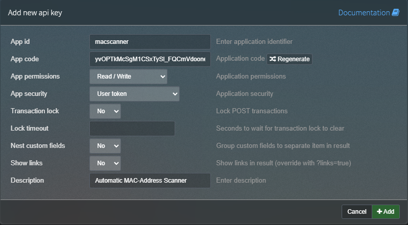
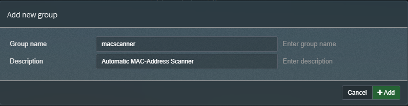
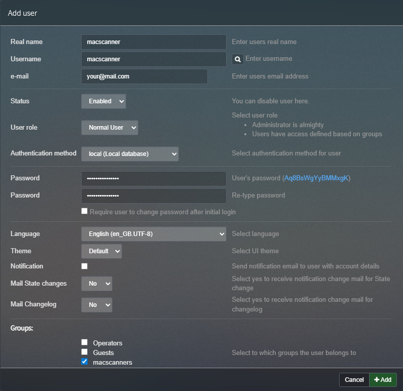

# phpIPAM MAC Scanner
<p align="center">
    <a href="https://deepwiki.com/YourGameSpace/phpipam-mac-scanner">
	    
    </a>
    <br><br>
    <a href="https://github.com/YourGameSpace/phpipam-mac-scanner/releases">
        
        
    </a>
	<a href="https://github.com/YourGameSpace/phpipam-mac-scanner/stargazers">
		
	</a>
</p>

This project comes as a pre-built docker image that automatically discovers and updates MAC addresses for IPs within a specified subnet in your [phpIPAM](https://phpipam.net/) instance.
* [How It Works](#how-it-works)
* [Setup](#setup)

## Features

*   Scans a specified subnet for active devices
*   Discovers MAC addresses using `arping`
*   Updates the corresponding IP address entries in phpIPAM with the discovered MAC address
*   Can be configured to ignore updates for IPs with specific tags (e.g., for statically assigned devices)
*   Runs on a configurable cron schedule
*   Updates the MAC address for the scanner's own IP(s) on the local interface

## How It Works

The container runs a shell script (`ipam-mac-scanner.sh`) based on a cron schedule.

The script performs the following steps:
1.  **Authentication:** It authenticates with the phpIPAM API using the provided `USERNAME` and `PASSWORD` to obtain a temporary API token.
2.  **Subnet Discovery:** It finds the internal ID of the target `SUBNET`.
3.  **Network Scan:** It iterates through all possible host IPs in the subnet (from .1 to .254) and sends an `arping` request to each.
4.  **MAC Address Update:** If an `arping` request receives a reply, the script extracts the MAC address and performs the following in phpIPAM:
    *   Verifies that the IP exists.
    *   Checks if the IP is associated with any tags listed in `IGNORED_TAGS`. If so, it skips the update.
    *   If the MAC address in phpIPAM is empty or different from the discovered one, it sends a `PATCH` request to update it.
5.  **Local Interface Scan:** It identifies the IP address(es) and MAC address of the container's own network interface and updates them in phpIPAM to ensure the scanner host is correctly documented.
6.  **Token Invalidation:** After the scan is complete, it invalidates the API token for security.

## Prerequisites

*   A running [phpIPAM](https://phpipam.net/) instance
*   [Docker](https://docs.docker.com/engine/install/) installed on the host machine (optional but recommended)
*   API access for phpIPAM with appropriate permissions
*   A separated user (recommended) with write access to the relevant subnets in phpIPAM
*   Host must have Layer-2 networking access

## Setup

### phpIPAM Setup
1.  Create an API key in phpIPAM **Settings** → **API**
    * App id: Any name you want (e.g., `macscanner`)
    * App permissions: Read / Write
    * App security: User token (SSL recommended)
    >
2.  Add a new group in phpIPMA under **Settings** → **Groups** (optional but recommended)
    >
3.  Go to **Settings** → **Sections** or create a new section
    * Assign Read-Write (rw) permissions for the group created in the previous step
    >
4.  Create a new user in phpIPAM under **Administration** → **Users**
       * Real name: Any name you want (e.g., `MAC Scanner User`)
       * Username: The username to use for API authentication (e.g., `macscanner`)
       * E-Mail: Your email address
       * User role: Normal User
       * Authentication method: local
       * Set a strong password
       * Assign the user to the created group in the previous step
       * Disable Notifications (optional)
       * Uncheck "Require user to change password after initial login"
       >
5.  Follow on of the installation methods below to start scanning.

### Docker Compose (recommended)

Create a `docker-compose.yml` file with the following content:

```yaml
services:
  phpipam-mac-scanner:
    image: ghcr.io/yourgamespace/phpipam-mac-scanner:1.0.2
    container_name: phpipam-mac-scanner
    restart: unless-stopped
    network_mode: "host" # Use host networking for arping to work correctly
    environment:
      - API_URL=https://phpipam.example.com/api # Replace with your actual phpIPAM API URL
      - API_APP_NAME=macscanner # Your app id created in phpIPAM
      - USERNAME=apiuser # Replace with your actual USERNAME
      - PASSWORD=your_secret_password # Replace with your actual USER password, NOT the API key
      - SUBNET=192.168.1.0/24 # Set to the subnet you want to scan
      - INTERFACE=eth0 # Change this to your **host's** interface name
      - IGNORED_TAGS=3,4 # See details [below](https://github.com/YourGameSpace/phpipam-mac-scanner#environment-variables)
      - CRON_SCHEDULE=*/30 * * * * # Adjust the cron schedule as needed (optional)
      - RUN_AT_STARTUP=true # Set to true to run the scan at container startup (optional)
```

Then, run the container:
```bash
docker-compose up -d
```

### Docker CLI

```bash
docker run -d \
  --name phpipam-mac-scanner \
  --network host \
  -e API_URL="https://phpipam.example.com/api" \
  -e API_APP_NAME="macscanner" \
  -e USERNAME="your_username" \
  -e PASSWORD="your_secret_password" \
  -e SUBNET="192.168.1.0/24" \
  -e INTERFACE="eth0" \
  -e CRON_SCHEDULE="*/30 * * * *" \
  -e RUN_AT_STARTUP="true" \
  ghcr.io/yourgamespace/phpipam-mac-scanner:1.0.2
```

### Standalone Script

If you prefer not to use Docker, you can run the script directly on a Linux host using crontab for example.
No documentation is provided for this method, as it is outside the scope of this project.

Required packages (May vary based on your distribution):
```bash
apt update -y && apt install curl arping jq iproute2 bash -y
```

## Updating

## Docker Compose
Simply pull the new image and start the container again:

```bash
docker pull ghcr.io/yourgamespace/phpipam-mac-scanner:1.0.2
docker-compose up -d
```

## Docker CLI

To update to the latest version, pull the new image and recreate the container:
```bash
docker pull ghcr.io/yourgamespace/phpipam-mac-scanner:1.0.2
docker run -d ... # (same command as above)
```

## Environment Variables

| Variable         | Description                                                                                                                                                                     | Default Value     | Required |
| ---------------- |---------------------------------------------------------------------------------------------------------------------------------------------------------------------------------| ----------------- |----------|
| `API_URL`        | The full URL to your phpIPAM API endpoint. (e.g., `https://phpipam.example.com/api`)                                                                                            | (none)            | **Yes**  |
| `API_APP_NAME`   | The name of the API application created in phpIPAM.                                                                                                                             | `macscanner`      | No       |
| `USERNAME`       | The username for the phpIPAM API user.                                                                                                                                          | `macscanner`      | No       |
| `PASSWORD`       | The password for the phpIPAM API user.                                                                                                                                          | (none)            | **Yes**  |
| `SUBNET`         | The subnet to scan in CIDR notation. (e.g., `192.168.1.0/24`)                                                                                                                   | (none)            | **Yes**  |
| `INTERFACE`      | The network interface inside the container to use for `arping`.                                                                                                                 | `eth0`            | No       |
| `IGNORED_TAGS`   | A comma-separated list of numeric tag IDs. IPs marked with these tags will not have their MACs updated.<br/>0: Disables this feature, 1: Offline, 2: Used, 3: Reserved, 4: DHCP | `3,4`             | No       |
| `CRON_SCHEDULE`  | The cron schedule for running the scan script.                                                                                                                                  | `*/30 * * * *`    | No       |
| `RUN_AT_STARTUP` | If set to `true`, the script will run once at container startup before the cron schedule begins.                                                                                | `false`           | No       |